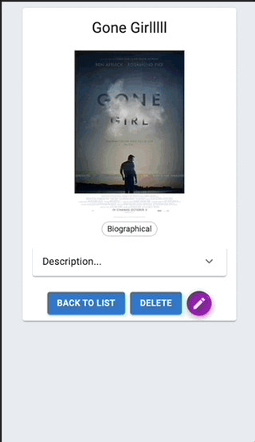

# Feedback App

## Description

_Duration: 2 Day Sprint_

The Movies app lets the user learn about movies.
 Chose a movie from the home screen to learn more about it. Genre/s and a description will be displayed. The genres will be displayed directly below the poster of the movie. Below the genres the user will find the description. Click the down arrow icon next to the description label
 to read all about the movie selected. The user can go back to the home screen by clicking the BACK TO LIST button, DELETE the movie, or Edit the movie.

 User can add a new movie to their collection by clicking Add New Movie. Fill in required fields such as Title, Image Url, and Description. Don't forget to chose a genre for the movie.

 

## Screen Shot

### Prerequisites

Link to software that is required to develop this website.

- [javascript](https://www.javascript.com/)
- [css]
- [html]
- [git](https://git-scm.com/)
- [github](https://github.com/)
- [body-parser](https://www.npmjs.com/package/body-parser)
- [pg](https://node-postgres.com/)
- [react](https://reactjs.org/)
- [redux](https://redux.js.org/)
- [axios](https://axios-http.com/)
- [express](https://expressjs.com/)
- [sql](https://www.mysql.com/)
- [sweetalerts2](https://sweetalert2.github.io/)
- [Sagas](https://redux-saga.js.org/)
- [Material UI](https://mui.com/)

## Installation

1. Go to https://github.com/tormodsletteboe/weekend-movie-sagas
2. Fork that repo into your own github account.
3. Copy the ssh address
4. In your terminal navigate to a folder you want to clone into.
5. Run `git clone [ssh address]` in your terminal
6. cd into the cloned folder and run `code .` in your terminal to open the project in vscode.
7. Run 'npm install'. Npm will look at your dependecies and install needed libraries.
8. Install postgress database using include database.sql file
    -  in termial execute  'createdb saga_movies_weekend' and 
    -  'psql -d saga_movies_weekend -f database.sql'
9. To start, execute in 2 separate terminals, 'npm run server' and 'npm run client'.
10. If it started, terminal will display 'server is up on port 5000', and a website on localhost 3000 will open.
11. You can now enjoy this Movie app.

## Usage

1. Click on a movie poster to learn more about it
2. On the details page of the movie clicked
    - Click the down arrow icon to read the description
    - Click the DELETE button to delete the movie. A modal will appear with Are you sure?
    - Click pencil icon to edit the movies Title, Image, Genre or Description.
3. To go back to the home screen, click BACK TO LIST button
4. Movies can be added in the Add New Movie page.
    - Fill in: 
        - Title
        - Image Url
        - Genre
        - Description
     - Click Save or Cancel.
        - Save will save the Movie to the database and bring user to homepage
        - Cancel will not save anything and take user to the homepage.
     

## Built With

javascript, css, html, git and github.com, body-parser, pg, sql, react, sweetalerts2, express, axios, redux, redux-saga

## Acknowledgement
Thanks to [Prime Digital Academy](www.primeacademy.io) who equipped and helped us to make this application a reality. (Edan Schwartz, Kris Szafranski)

## Support
If you have suggestions or issues, please email me at [tormod.slettebo@gmail.com] 

